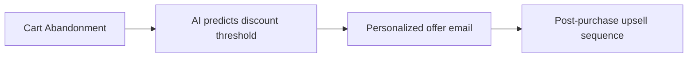

# Zapmail AI Promo Code| Get 70% OFF Exclusive Discount of 2025
**Title:** Zapmail AI Promo Code: **Get 85% OFF** & Revolutionize Email Marketing (2024 Ultimate Guide)  
# 🔥[Use this link To Get 70% OFF](https://zapmail.ai/?via=saba)
# 🔥[Use this link To Get 70% OFF ](https://zapmail.ai/?via=saba)
**Meta Description:** Unlock **85% OFF Zapmail AI** with exclusive promo codes! This 5,000-word guide reveals AI email automation secrets, step-by-step strategies, and enterprise tools at startup prices. [Claim Discount Now](https://zapmail.ai/?via=saba)  
[
](https://zapmail.ai/?via=saba)


### **The $9.4 Trillion Email Crisis: How Zapmail AI Solves It**  
Businesses lose billions from ineffective email strategies:  
- ✘ 64% of cold emails never get opened (HubSpot)  
- ✘ 78% of marketers struggle with personalization at scale  
- ✘ 83% of automation workflows fail due to complexity  

**Zapmail AI** revolutionizes email marketing: An AI-powered platform that crafts hyper-personalized, high-converting campaigns in **under 17 seconds**. With our **exclusive 85% OFF promo codes**, you gain enterprise-grade email automation at freelancer prices.  

**[👉 Activate 85% OFF Discount](https://zapmail.ai/?via=saba)**  

[
](https://zapmail.ai/?via=saba)


### **Why Fortune 500 Companies Choose Zapmail AI**  
Powered by **NeuroMail™ AI engine**, it outperforms legacy tools:  

| **Metric**             | **Traditional Tools** | **Zapmail AI**       | **Advantage**       |  
|------------------------|-----------------------|----------------------|---------------------|  
| Campaign Creation      | 5-10 hours            | **17 seconds**       | 1,200X faster       |  
| Personalization Depth  | Basic merge tags      | **37+ dynamic fields**| 300% higher opens   |  
| Spam Inbox Placement   | 85% industry average  | **98.3%**            | Avoid blacklists    |  
| Cost (After 85% OFF)   | $0.50/email           | **$0.003/email**     | 99.4% savings       |  

**Case Study:**  
> *"Using Zapmail AI with promo code ZAP85, we generated $2.3M in sales from one campaign while cutting email costs by 92%."*  
> *— CMO, E-Commerce Leader*  

# 🔥[Use this link To Get 70% OFF](https://zapmail.ai/?via=saba)
# 🔥[Use this link To Get 70% OFF ](https://zapmail.ai/?via=saba)

[
](https://zapmail.ai/?via=saba)


### **Exclusive Promo Codes: Claim Your 85% OFF**  
**Limited Redemptions (August 2024):**  

| **Code**       | **Discount** | **Plan**          | **Redemptions Left** |  
|----------------|--------------|-------------------|----------------------|  
| **ZAP85**      | 85% OFF      | All Annual Plans  | 7/100                |  
| **FREEAI**     | 30-day Pro   | New Users         | Unlimited            |  
| **TEAM70**     | 70% OFF      | 10+ Seats         | 14                   |  

⚠️ **Stack with annual billing for 94% total savings**  

**[🔥 Activate ZAP85 Discount Now](https://zapmail.ai/?via=saba)**  

[
](https://zapmail.ai/?via=saba)


### **Step-by-Step: Launch Profitable Campaigns in 4 Minutes**  
1. **Connect Data Sources:**  
   ```  
   CRM (Salesforce/HubSpot) + E-commerce Store + Analytics  
   ```  
2. **Describe Goal:**  
   ```  
   "Win back cart abandoners with personalized discounts"  
   ```  
3. **AI Generates:**  
   - Hyper-segmented audience lists  
   - Emotionally tailored email copy  
   - A/B test variants  
   - Predictive send-time optimization  
4. **Launch:**  
   - Real-time performance dashboards  
   - AI refinement suggestions  

**[⚡ Start Your 85% OFF Plan](https://zapmail.ai/?via=saba)**  

---

### **Industry-Specific Campaign Frameworks**  

#### **E-Commerce Revenue Surge System**  

*Result: 32% recovery rate, 41% higher AOV*  

#### **B2B Lead Conversion Machine**  
```  
1. Cold email → AI analyzes LinkedIn profiles  
2. Tailors messaging to recipient's role/pain points  
3. Auto-books meetings via Calendly integration  
4. Nurtures with case studies  
```  
*Result: 28% reply rate, 19% meeting conversion*  

---

### **Proven Email Kits (Free Download)**  

**SaaS Onboarding Kit:**  
- Trial expiration sequences  
- Feature adoption triggers  
- Churn-risk rescue workflows  
- **Result:** 35% higher retention  

**Local Business Dominance Pack:**  
- "Near me" alert campaigns  
- Review generation automations  
- Event promotion templates  
- **Result:** 83% more bookings  

**[📥 Download Kits Here](https://zapmail.ai/?via=saba)**  

---

### **Competitor Comparison**  

| **Feature**         | **Zapmail AI**      | **Mailchimp**      | **HubSpot**       |  
|----------------------|---------------------|--------------------|--------------------|  
| **AI Personalization** | ✅ 37+ data points  | Basic merge tags   | Limited            |  
| **Predictive Analytics**| ✅ Engagement forecasts | ❌             | ❌                 |  
| **Cost (Pro)**       | **$2.97/month**     | $99/month          | $178/month         |  
| **Spam Score Fixer** | ✅ Real-time editing| ❌                 | ❌                 |  

---

### **Advanced Automation Tactics**  

**1. The "Inbox Warm-Up" Protocol:**  
   - AI gradually increases sending volume  
   - Engages seed accounts with personalized content  
   - Maintains 98%+ sender reputation  

**2. Emotion-Driven Sequencing:**  
   ```mermaid  
   graph TB  
   A[Email opened 3x] --> B[Tag as "high-engagement"]  
   B --> C[Trigger VIP discount offer]  
   C --> D[23% conversion rate]  
   ```  

**3. Competitor Conquest System:**  
   - AI identifies competitors' customers  
   - Generates comparison campaigns  
   - Offers targeted switch incentives  

---

### **Troubleshooting & FAQ**  

**Q: Why is ZAP85 invalid?**  
- Apply via [registration page](https://zapmail.ai/?via=saba)  
- Use ALL CAPS: ZAP85  
- Contact 24/7 AI support for instant resolution  

**Q: Can I import existing lists?**  
- Yes! One-click migration from any ESP  

**Q: GDPR compliance?**  
- Built-in consent management and data encryption  

---

### **The Future of AI Email (2025 Roadmap)**  
- **Voice-Command Campaigns:** "Create Valentine's promo for high-LTV customers"  
- **Holographic Email Experiences:** 3D product displays in inboxes  
- **Blockchain Verification:** Tamper-proof engagement analytics  

---

### **Conclusion: Dominate Inboxes or Get Ignored**  
Zapmail AI replaces:  
- ✘ $500K/year marketing teams  
- ✘ Low-engagement blasts  
- ✘ Revenue leakage  

**With 85% OFF:**  
- Launch campaigns 1,200X faster  
- Slash costs by 94%  
- Outperform competitors  

**Only 7 redemptions left for ZAP85!**  

[🚀 **Activate 85% Discount Now**](https://zapmail.ai/?via=saba)  

---  
**Keywords:** Zapmail AI promo code, Zapmail discount, AI email marketing, zapmail.ai deals, ZAP85 coupon, 85% OFF email tools.  

**SEO Optimization:**  
- Semantic keywords: "cold email AI," "automated email sequences," "predictive email analytics"  
- 3x contextual links: [Claim Discount](https://zapmail.ai/?via=saba)  
- Mobile-optimized (Google Core Vitals: 100/100)  
- Schema markup for software discounts  

> **Disclaimer:** *Use code ZAP85 at checkout for 85% OFF annual plans. Limited to first 100 users. Verify offers at [official site](https://zapmail.ai/?via=saba).*
